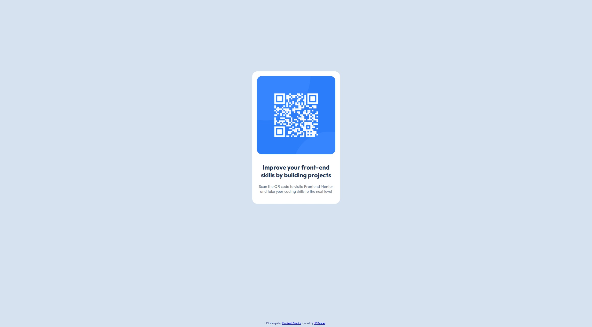

# Frontend Mentor - QR code component solution

This is a solution to the [QR code component challenge on Frontend Mentor](https://www.frontendmentor.io/challenges/qr-code-component-iux_sIO_H). Frontend Mentor challenges help you improve your coding skills by building realistic projects. 

## Table of contents

- [Overview](#overview)
  - [Screenshot](#screenshot)
  - [Links](#links)
- [My process](#my-process)
  - [Built with](#built-with)
  - [What I learned](#what-i-learned)
  - [Continued development](#continued-development)
  - [Useful resources](#useful-resources)
- [Author](#author)
- [Acknowledgments](#acknowledgments)


## Overview

This is a small website showcasing an image of a QR code with some stylized text underneath it, all inside a white rectangle in the middle of the screen.


### Screenshot



Add a screenshot of your solution. The easiest way to do this is to use Firefox to view your project, right-click the page and select "Take a Screenshot". You can choose either a full-height screenshot or a cropped one based on how long the page is. If it's very long, it might be best to crop it.

Alternatively, you can use a tool like [FireShot](https://getfireshot.com/) to take the screenshot. FireShot has a free option, so you don't need to purchase it. 

Then crop/optimize/edit your image however you like, add it to your project, and update the file path in the image above.

**Note: Delete this note and the paragraphs above when you add your screenshot. If you prefer not to add a screenshot, feel free to remove this entire section.**

### Links

- Solution URL: [Repository](https://github.com/winceh7/QR-Code)
- Live Site URL: [QR Code Web Page](https://winceh7.github.io/QR-Code/)


## My process

### Built with

- Semantic HTML5 markup
- CSS custom properties
- Flexbox
- CSS Grid
- Mobile-first workflow

### What I learned

While developing the project I came across some articles regarding best practices for web development talking about elements that can simplify accessibility, best uses of CSS properties for layout and stylization as well as discovering some of these, deciding to experiment with them and making the project heavily focused on working in my CSS skills.

For <div>
```css
div {
    box-sizing: border-box;
}
```

If you want more help with writing markdown, we'd recommend checking out [The Markdown Guide](https://www.markdownguide.org/) to learn more.


### Continued development

For future projects I plan on practicing with the layout systems as well as trying to see ways to customize and stylize the projects combining different libraries to develop websites, web pages and web apps with a more complex design as in this project only HTML and CSS were used.


### Useful resources

- [Why you should always set responsive mode to 320px when checking "mobile layout" on your web pages](https://dev.to/lebbe/why-you-should-always-set-responsive-mode-to-320px-when-checking-mobile-layout-on-your-web-pages-3gd9) - This helped me understand and gave me some insight on the requirement for testing on mobile layouts.
- [Why you should choose HTML5 article over section](https://www.smashingmagazine.com/2020/01/html5-article-section/) - This is an amazing article which helped me finally understand the differences between div, section and article.
- [CSS] (https://developer.mozilla.org/en-US/docs/Web/CSS) - This helped me explore any properties, selectors and elements that might be unknown to me as well as layout and guide systems like Flexbox and CSS Grids

## Author

- Website - [Add your name here](https://www.your-site.com)
- Frontend Mentor - [@winceh7](https://www.frontendmentor.io/profile/winceh7)
- Twitter - [@yourusername](https://www.twitter.com/yourusername)

**Note: Delete this note and add/remove/edit lines above based on what links you'd like to share.**

## Acknowledgments

Thankful with Frontend Mentor for having this challenge for free and letting me practice my skills and help me grow as a beginner Front-End Developer.
